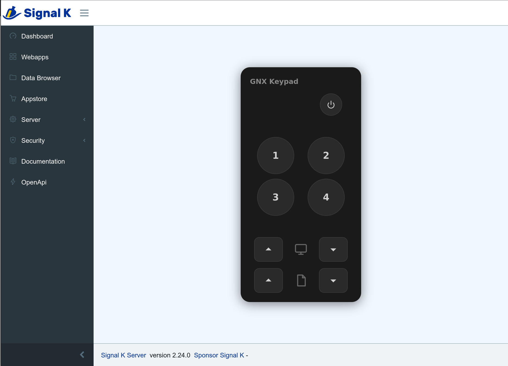

# signalk-garmin-keypad

Signal K server plugin that acts as a Garmin GNX Keypad on NMEA 2000, allowing control of GNX instrument displays from a web browser.



## Features

- **Preset selection** (1-4) — short press to recall, long press to save
- **Page navigation** — up/down on the active display
- **Display selection** — cycle between GNX displays in the group
- **Power control** — sleep/wake
- **Auto-discovery** — group ID, display count, keypad fingerprint, and per-property counters are all discovered automatically from bus traffic
- **Embeddable webapp** — dark-themed UI matching the physical keypad, embedded in the Signal K admin UI via Module Federation

## Protocol

Sends Garmin proprietary NMEA 2000 messages:

- **PGN 61184** — single-frame button events (preset select/save, page navigation)
- **PGN 126720** — fast-packet property commands (display selection, sleep/wake)

Property commands use a per-property sequence counter and a keypad fingerprint that must match what the displays have stored. On first use, the plugin sends a command that the display rejects (NACK), discovers the correct counter and fingerprint from the rejection, then retries with corrected values.

## Prerequisites

- Signal K server with an NMEA 2000 gateway (e.g. Actisense NGT-1, Yacht Devices YDWG-02)
- One or more Garmin GNX displays configured in a group

> **Note:** The displays may need to have been grouped with a real Garmin GNX Keypad at least once before this plugin can control them. The group binding token and fingerprint are persisted in display NVM during initial pairing — without a prior pairing, these values may not exist for the plugin to discover. This is speculative and has not been confirmed.

## Configuration

| Option | Description | Default |
|---|---|---|
| Source Address | NMEA 2000 source address for the keypad | 0 |
| GNX Group ID | 4-byte group binding token (8 hex digits). Leave blank to auto-discover. | auto |
| Display Count | Number of displays in the group. Set to 0 to auto-discover. | 0 |
| Keypad Fingerprint | 2-byte keypad fingerprint (4 hex digits). Leave blank to auto-discover. | auto |

## REST API

All endpoints at `/plugins/signalk-garmin-keypad/`:

| Method | Path | Body |
|---|---|---|
| GET | `/state` | — |
| POST | `/preset/select` | `{ "index": 0-3 }` |
| POST | `/preset/save` | `{ "index": 0-3 }` |
| POST | `/page` | `{ "direction": "next" \| "previous" }` |
| POST | `/display/cycle` | `{ "direction": "up" \| "down" }` |
| POST | `/power` | `{ "action": "sleep" \| "wake" }` |

## Development

```sh
npm install
npm run build:plugin   # compile TypeScript
cd webapp && npm install && npm run build  # build React webapp
npm test               # run tests
```

## Disclaimer

This project is an independent demo and is not affiliated with, endorsed by, or connected to Garmin or its subsidiaries. "Garmin" and "GNX" are trademarks of Garmin. Use at your own risk. The authors assume no liability for any damage to equipment or loss of functionality resulting from the use of this software.

## License

Apache-2.0
